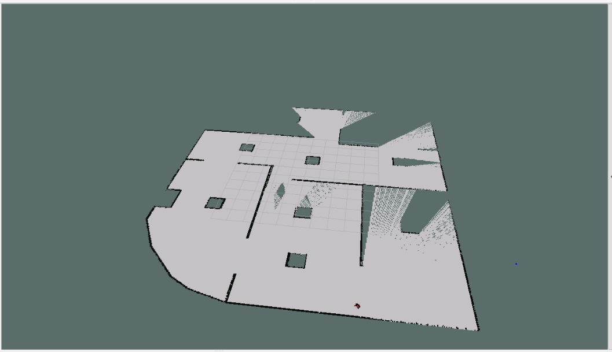
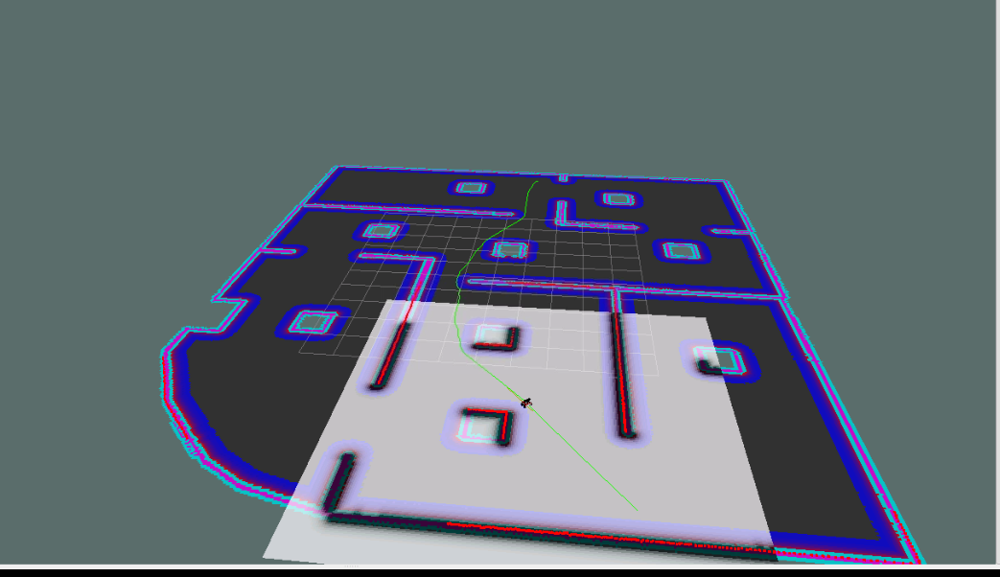
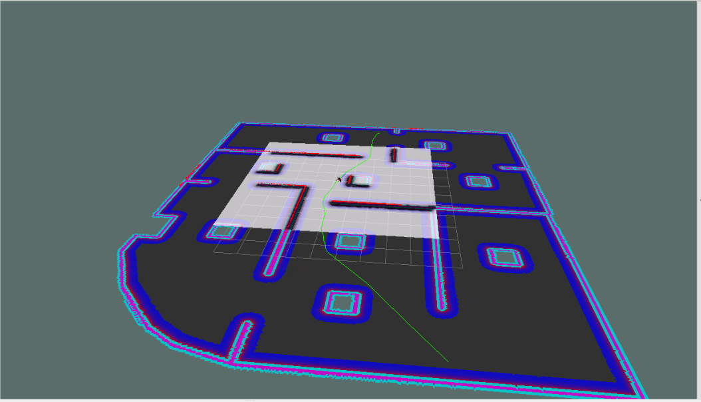
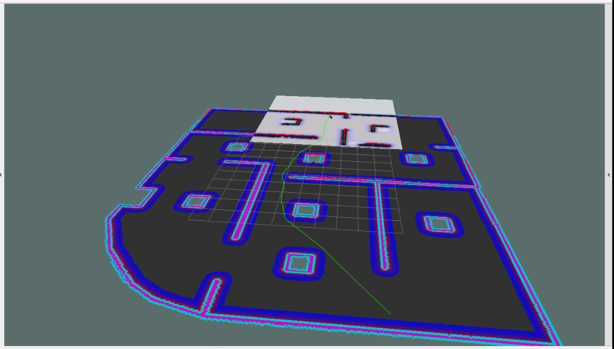

# gpproject_me
This project involves the creation a Pathplanner using ROS Move base package. 

## Environment
This project was done using ROS noetic and python.
The physical implementtion was done on a ROSBOT 2 pro.
Note: The environment used for simulation isnt available in this repo.

## Steps for testing in simulation
 The catkin workspace package name is 'myproject'. You can name the package as you like. Make sure to substitute the package name where ever applicable. For the visual output of gmapping and movebase nodes results i used the rviz node . You can launch the rviz node with the command below. For each process there are saved configurations to view the results. 
```
rosrun rviz rviz
```
**1.** Map the simulation environment using the gmapping launch file and tele-op keyboard node. The tele-op  node is used to control the robot manually for mapping the environment. The image below shows a snapshot of the process of creating the map.

**Commands.**
```
roslaunch myproject gmapping.launch
```

```
rosrun teleop_twist_keyboard teleop_twist_keyboard.py
```




**2.** Save the built map with map server node to the package root directory. The files 'map.pgm' and 'map.yaml' in the root directory are my saved maps.


**3.** Run the movebase launch file. Feed in goal poses using Rviz and see the robot move to the goal. The images below show the path planner working in the simulation environment.

**Commands.**
```
roslaunch myproject move_base.launch
```






